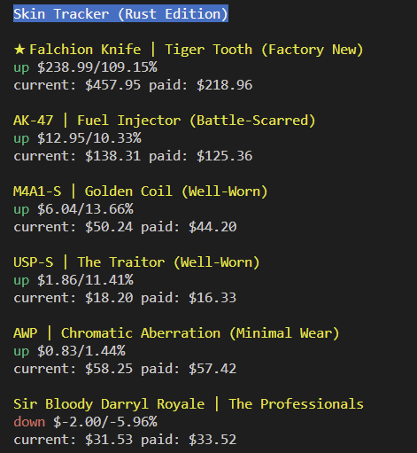

# Steam Market API

🎮 Use the Steam Market API tool to compare the prices of items on the Steam market.

## Quick Start

💻 Build the CLI tool with `cargo build --bin cli`.

🏃‍♂️ Run the CLI tool with `cargo run --bin cli <optional currency ratio argument>`.

💰 Use the optional currency ratio argument (`cargo run --bin cli <currency ratio>`) to convert prices from USD to another currency. Pass a float value that represents the ratio between USD and your desired currency. For example, if you want to view prices in Canadian dollars and the USD to CAD ratio is 1:1.36, you would run the tool with `cargo run --bin cli 1.36`.

📝 Add items to `cs_items.toml` with the exact item name, game ID, and USD price.

📈 View output similar to a stock tracker with information on your item investments.

## Example Output

